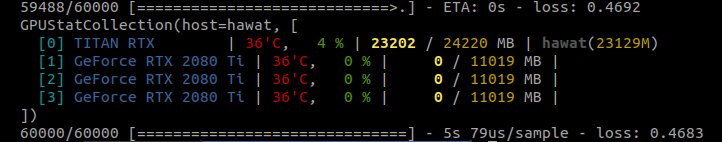
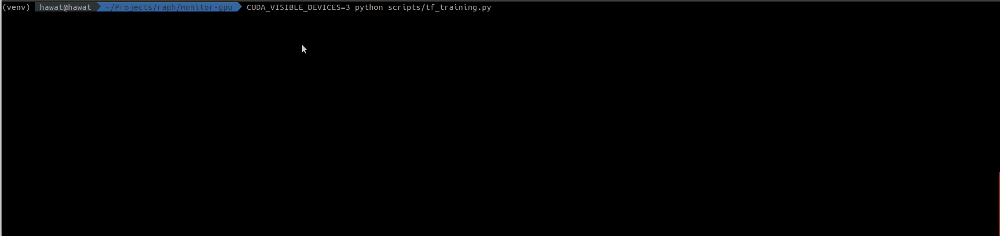

# gpumonitor

`gpumonitor` gives you **stats about GPU** usage during execution of your scripts and trainings,
as [TensorFlow](https://www.github.com/tensorflow/tensorflow) or 
[Pytorch Lightning](https://github.com/PyTorchLightning/pytorch-lightning) callbacks.

<p align="center">
    
</p>


## Installation

Installation can be done directly from this repository:

```
pip install https://github.com/sicara/gpumonitor/archive/master.zip
```

## Getting started


<p align="center">
    
</p>

### Option 1: In your scripts

```python
monitor = gpumonitor.GPUStatMonitor(delay=1)

# Your instructions here
# [...]

monitor.stop()
monitor.display_average_stats_per_gpu()
```

### Option 2: Callbacks

Add the following callback to your training loop:

For [TensorFlow](https://www.github.com/tensorflow/tensorflow),

```python
from gpumonitor.callbacks.tf import TFGpuMonitorCallback

model.fit(x, y, callbacks=[TFGpuMonitorCallback(delay=0.5)])
```

For [PyTorch Lightning](https://github.com/PyTorchLightning/pytorch-lightning),

```python
from gpumonitor.callbacks.lightning import PyTorchGpuMonitorCallback

trainer = pl.Trainer(callbacks=[PyTorchGpuMonitorCallback(delay=0.5)])
trainer.fit(model)
```


## Sources

- Built on top of [GPUStat](https://github.com/wookayin/gpustat)
- Separate thread loop coming from [gputil](https://github.com/anderskm/gputil)
